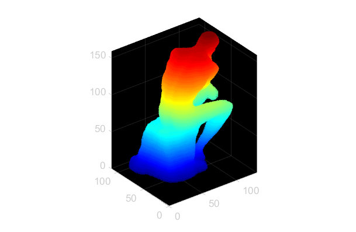
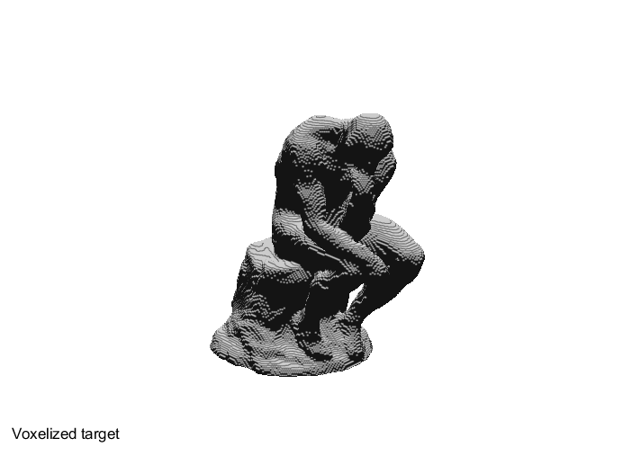
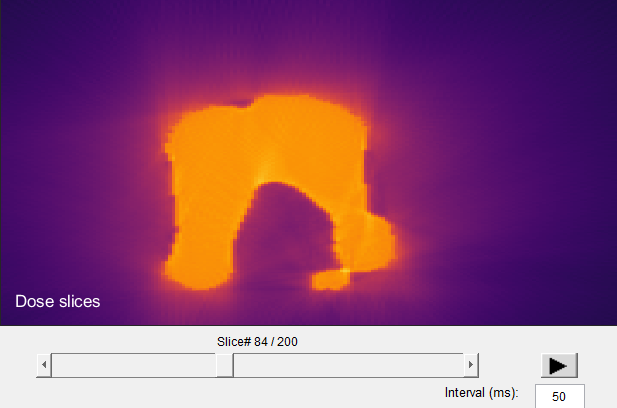
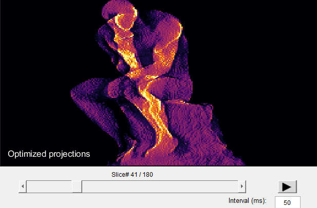
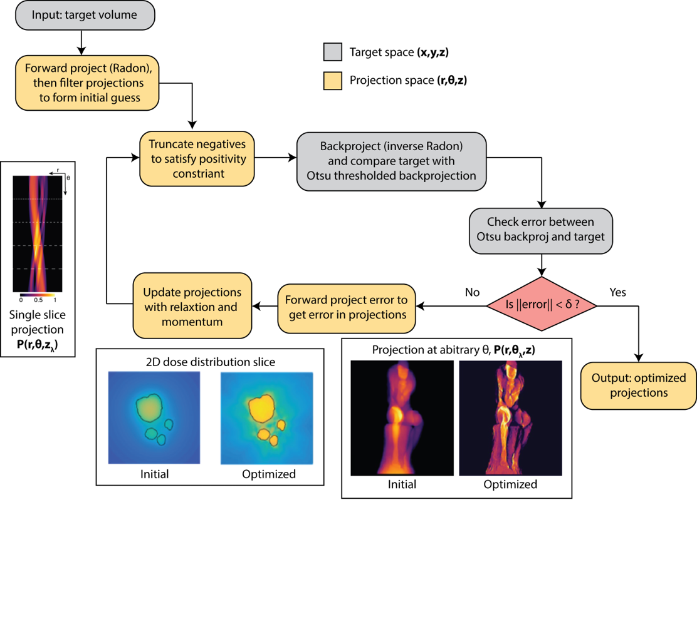

# CAL-software
This README describes how the CAL projection-generation/optimization and projector-control code should be used. 
This code has been developed in Matlab 2018b and 2019a and is compatible, to our knowledge, with 2017a and newer versions. 

More details on the algorithms used in this software can be found here:  
[Science article](https://science.sciencemag.org/content/363/6431/1075) (Paywall)  
[Arxiv article](https://arxiv.org/pdf/1705.05893.pdf)


## Projection Optimization
The optimization code consists of the main script and supporting functions:
```
main_optimize.m
voxelize_target.m
initialize_projections.m
optimize_projections.m
filter_projections.m
exp_iradon.m
gen_att_table.m
find_threshold.m
find_scale.m
get_voxel_count.m
show_projections.m
show_dose_slices.m
```

### Steps of main_optimize.m:
1. **Parameter definition:** All system and optimization parameters are defined within the params struct.
   - The target should be defined by assigning the name of an STL file in the directory to params.stl_filename or by directly assigning a 2D or 3D matrix to the fields, "params.target_2D" or "params.target_3D".
   - The optimization parameters are then assigned. These will need to be tweaked to change the step size and convergence depending on the trial and error results of optimization. We have had good results with 30-90 iterations and learning rate of ~0.001-0.01.

2. **Prepare target:** voxelize_target.m is called which handles voxelization of an STL file, if defined,
and creation of the target_care_area which is a slightly dilated version of the target matrix. Below are examples of a prepared target using pcshow or volshow options of the "params.vol_viewer" parameter.

<table>
  <tr>
    <td align="center">pcshow</td>
    <td align="center">volshow</td>
  </tr>
  <tr>
    <td></td>
    <td></td>
  </tr>
 </table>


3. **Initialize projections:** intialize_projections.m is called to create an initial guess of the projections to be 
optimized. The initial guess is created with a ramp-filtered negative-truncated projection.

4. **Optimize:** optimize_projections.m is called to optimize the initial projections and minimize the error between the target and the backprojected reconstruction of the projections. params.max_iterations
sets the maximum number of iterations and, if defined, params.tol sets the error tolerance
for the optimization.

5. **Display:** show_projections.m and show_dose_slices.m are called to display the optimized projections in sequence and the reconstructed dose profile in slices, respectively. Below are examples of the output sliced dose profile and optimized projections. The figures are scrollable which allows easy slice viewing.

<table>
  <tr>
    <td align="center">Dose slices</td>
    <td align="center">Optimized projections</td>
  </tr>
  <tr>
    <td></td>
    <td></td>
  </tr>
 </table>

### Block Diagram

<p align="center">
  
</p>

## Projector Control
The projector control code consists of the main script and
supporting functions:
```
main_projector_control.m
create_projection_set.m
project.m
```

### Steps of main_projector_control.m:
1. **Parameter definition:** All system and projection parameters are defined within the params struct.
2. **Generate projection images:** create_projection_set.m is called to convert the optimized projections matrix into a set of modified images based on the input parameters so that they can be projected.
2. **Projection:** project.m is called to project the projection_set images at the refresh rate determined by the defined rotational velocity set in "params.rot_velocity."

## Requirements:
- The parfor (parallel for loop) function used in initialize_projections.m and optimize_projections.m is part of the Matlab Parallel Computing Toolbox (https://www.mathworks.com/help/parallel-computing/index.html). 
If parallel computation is desired to speed up optimization for large targets and the “params.parallel” is set to 1 to activate parallel computation this toolbox must be installed.

- The pcshow function used in voxelize_target.m and optimize_projections.m is part of the Matlab Computer Vision Toolbox (https://www.mathworks.com/help/vision/index.html). 
If pcshow is chosen as the volume viewer by setting “params.vol_viewer” to “pcshow” this toolbox must be installed.

- The volshow function used in voxelize_target.m and optimize_projections.m is part of the Matlab Image Processing Toolbox (https://www.mathworks.com/help/images/index.html). 
If volshow is chosen as the volume viewer by setting “params.vol_viewer” to “volshow” this toolbox must be installed.

- The project.m function uses the third-party Pyschtoolbox (http://psychtoolbox.org/) for control of an auxiliary screen through HDMI or display port. 
To use the project.m function this toolbox must be installed. Also, the screen which the projector is detected as should be defined as Screen 2 within Windows. 

## NOTES:
- The calibration intensity curve included in the repository (intensity_sorted.mat) is that of the Lightcrafter PRO4500 405nm projector that is used in our lab. 
For best results this calibration curve should be replaced with a curve representing the projector that is used in the setup. A simple arbitrary units intensity calibration
can be done by recording the intensity for each bit value of the projector. For 8-bit grayscale projection, this corresponds to 256 intensities. 

- VOXELISE.m, COMPUTE_mesh_normal.m, and CONVERT_mesh_format.m inside the STL_read_bin, were obtained from the Matlab file exchange and were written by Adam H. Aitkenhead (adam.aitkenhead@christie.nhs.uk) at The Christie NHS Foundation Trust. (https://www.mathworks.com/matlabcentral/fileexchange/27390-mesh-voxelisation)

- autoArrangeFigures.m inside autoArrangeFigures_bin was obtained from the Matlab file exchange and was written by JaeJun Lee, of Koreatech, Korea Republic. (https://www.mathworks.com/matlabcentral/fileexchange/48480-automatically-arrange-figure-windows)

- imshow3d.m inside imshow_3D_bin was obtained from the Matlab file exchange and was written by Maysam Shahedi (mshahedi@gmail.com). (https://www.mathworks.com/matlabcentral/fileexchange/41334-imshow3d)
