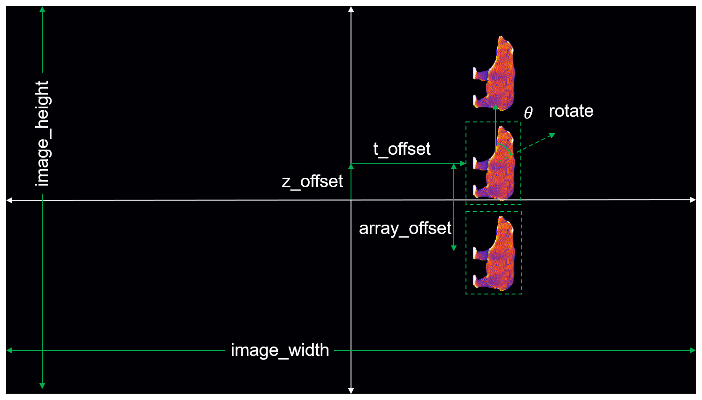

.. _imagesetcreation:

==================
Image set creation
==================

.. class:: CALCreateImageSet(projection_obj,image_params)

    Constructor for the :class:`CALCreateImageSet` class that creates an image set given a :class:`ProjObj` and structure of image transformation parameters.

    :Parameters:    * projection_obj - :class:`ProjObj` containing the projections OR a "plain" 3D projection matrix (FOR BACKWARD COMPATIBILITY)
                    
                    * image_params - structure of image transformation parameters (refer to image at the end of this section for visual depiction of some of the parameters)
                        * image_width     -  width in pixels of the projection display                             
                        * image_height     -  height in pixels of the projection display
                        * t_offset          - offset in the transverse or x-direction in pixels of the projection within the image
                        * z_offset      - offset in the z-direction in pixels of the projection within the image                       
                        * array_num    - number of copies of the projection within the image
                        * array_offset    - offset in the z-direction in pixels of each copy from each other
                        * size_scale_factor    - size scaling of the projection within the image           
                        * intensity_scale_factor    - intensity scaling of the projection within the image (intensity saturates at 255)
                        * invert_vert          -  flip orientation of the projection within the image over the transverse or horizontal axis
                        * rotate        - rotation in degrees of the projection within the image
                        * angles(ONLY FOR BACKWARD COMPATIBILITY) - angles of the input 3D projection matrix

                        +------------------------+-----------------+
                        | **image_params.x**     |**Default value**|
                        +------------------------+-----------------+
                        | image_width            |    1920         |
                        +------------------------+-----------------+
                        | image_height           |    1080         |
                        +------------------------+-----------------+
                        | t_offset               |   0             |
                        +------------------------+-----------------+
                        | z_offset               |   0             |
                        +------------------------+-----------------+
                        | array_num              |   1             |
                        +------------------------+-----------------+
                        | array_offset           |   0             |
                        +------------------------+-----------------+
                        | size_scale_factor      |  1              |
                        +------------------------+-----------------+
                        | intensity_scale_factor |   1             |
                        +------------------------+-----------------+
                        | invert_vert            |   0             |
                        +------------------------+-----------------+
                        | rotate                 |   0             |
                        +------------------------+-----------------+

    :Returns:       * obj - instance of :class:`CALCreateImageSet`

    .. classmethod:: run(obj) 

    :Parameters:    * None

    :Returns:       * image_set_obj - :class:`ImageSetObj` containing the image set

    .. staticmethod:: flipUD(proj)
    
    :Parameters:    * proj - 3D projection matrix

    :Returns:       * out - flipped input over transverse or horizontal axis

    .. staticmethod:: flipLR(proj)
    
    :Parameters:    * proj - 3D projection matrix

    :Returns:       * out - flipped input over z-axis

    .. staticmethod:: rotate(proj,angle)
    
    :Parameters:    * proj - 3D projection matrix
                    * angle - rotation angle in degrees

    :Returns:       * out - input rotated by the input angle in the t-z plane

    .. staticmethod:: sizeScale(proj,scale)
    
    :Parameters:    * proj - 3D projection matrix
                    * scale - size scale factor

    :Returns:       * out - input scaled by the input size scale factor

    .. staticmethod:: intensityScale(proj,scale)
    
    :Parameters:    * proj - 3D projection matrix
                    * scale - intensity scale factor

    :Returns:       * out - input scaled by the input intensity scale factor

    .. staticmethod:: arrayInsertProj(proj,image_width,image_height,t_offset,z_offset,array_num,array_offset)
    
    This method inserts a scaled and rotated projection into an image of the specified size (multiple times if specified by ``array_num``).

    :Parameters:    * proj - 3D projection matrix
                    * image_width - display image width
                    * image_height - display image height
                    * t_offset - offset in the transverse or x-direction in pixels of the projection within the image
                    * z_offset - offset in the z-direction in pixels of the projection within the image
                    * array_num - number of copies of the projection within the image
                    * array_offset - offset in the z-direction in pixels of each copy from each other

    :Returns:       * image - image containing projection with transformations and translations applied

    .. staticmethod:: saveImages(image_set_obj,save_path,image_type)
    
    :Parameters:    * image_set_obj - :class:`ImageSetObj` containing the image set
                    * save_path - full path of the save location of a folder called ``images`` containing individual images named ``0001.jpg``, ``0002.jpg``, and so on, for example. 
                    * image_type - file extension of image such as ``'.jpg'``, ``'.png'``, ``'.bmp'``, etc. The available image types can be found in Matlab's documentation for `imwrite() <https://www.mathworks.com/help/matlab/ref/imwrite.html#btv3cny-1-fmt>`_
    :Returns:       * out - input scaled by the input intensity scale factor

