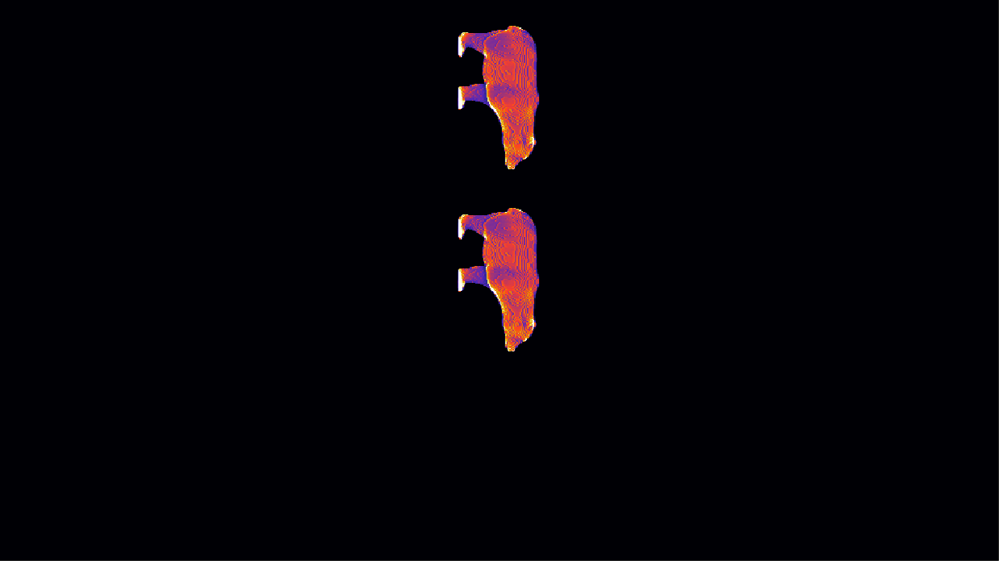

.. _examples:

========
Examples
========
.. highlight:: matlab

Projection generation and optimization
**************************************

2D matrix example
-----------------
This example shows how to use the CAL-software Toolbox to generate projections for directly specified 3D matrix. The function :func:`createTarget()`
will create an example 2D matrix to optimize. 
::
    clear all
    close all

    % set projection parameters
    proj_params.angles = linspace(0,179,180);

    % set optimization parameters
    opt_params.max_iter = 50;
    opt_params.threshold = 0.85;

    verbose = 1;

    % create an example 2D target
    target_2D = createTarget(201,'L',2);

    % prepare the target
    target_obj = CALPrepTarget([],[],verbose,target_2D);

    % instantiate the optimization class
    Opt = CALOptimize(target_obj,opt_params,proj_params,verbose);

    % run the optimization
    [proj_obj,recon_obj,Opt] = Opt.run();

3D matrix example
-----------------
This example shows how to use the CAL-software Toolbox to generate projections for directly specified 3D matrix. The function :func:`createTarget()`
will create an example 3D matrix to optimize. 
::
    clear all
    close all

    % set projection parameters
    proj_params.angles = linspace(0,179,180);

    % set optimization parameters
    opt_params.max_iter = 40;
    opt_params.threshold = 0.85;

    verbose = 1;

    % create an example 3D target
    target_3D = createTarget(201,'L',3);

    % prepare the target
    target_obj = CALPrepTarget([],[],verbose,target_3D);

    % instantiate the optimization class
    Opt = CALOptimize(target_obj,opt_params,proj_params,verbose);

    % run the optimization
    [proj_obj,recon_obj,Opt] = Opt.run();

STL example
-----------
This example shows how to use the CAL-software Toolbox to generate projections for a .stl file. NOTE: ``stl_filename`` should be 
replaced with the filepath to the .stl file you would like to use. This example loads the filepath to a .stl file that is included
in the toolbox for convenience of testing the installation.
::
    clear all
    close all

    % set projection parameters
    proj_params.angles = linspace(0,179,180);
    proj_params.bit8 = 1;

    % set optimization parameters
    opt_params.max_iter = 50;
    opt_params.threshold = 0.8;
    opt_params.learning_rate = 0.005;

    verbose = 1;

    % prepare the target
    resolution = 140;
    stl_filename = loadExStlFilename('bear'); % acceptable inputs 'bear', 'thinker', 'octet', 'octahedron'
    target_obj = CALPrepTarget(stl_filename,resolution,verbose);

    % instantiate the optimization class
    Opt = CALOptimize(target_obj,opt_params,proj_params,verbose);

    % run the optimization
    [proj_obj,recon_obj,Opt] = Opt.run();

------

Image set creation
******************

Typical example
---------------
This example shows how to set the image parameters and create an image set from a projection object. If the STL example above is run before this example the image set should appear as in the image below.
::
    image_params.size_scale_factor = 2;
    image_params.invert_vert = 1;
    image_params.z_offset = 100;
    image_params.array_num = 2;
    image_params.array_offset = 350;
    image_params.image_width = 1920; % this parameter MUST be changed to match your projector image width for proper scaling
    image_params.image_height = 1080; % this parameter MUST be changed to match your projector image height for proper scaling
 
    C = CALCreateImageSet(proj_obj,image_params);

    image_set_obj = C.run();

    Display.showImageSet(image_set_obj)
    
    % Images may be saved also
    % C.saveImages(image_set_obj,pwd,'.png');

Backward compatibility example
------------------------------
This example shows how to set the image parameters and create an image set from a projection matrix (for backward compatibility). 
::
    image_params.size_scale_factor = 2;
    image_params.invert_vert = 1;
    image_params.image_width = 1920; % this parameter MUST be changed to match your projector image width for proper scaling
    image_params.image_height = 1080; % this parameter MUST be changed to match your projector image height for proper scaling
    image_params.angles = linspace(0,179,180); % this parameter must be added 

    C = CALCreateImageSet(optimized_projections,image_params); % Note: now a 3D matrix is in the place of the typical projection object

    image_set_obj = C.run();

    Display.showImageSet(image_set_obj)

    % Images may be saved also
    % C.saveImages(image_set_obj,pwd,'.png');

-----

Image sequence projection
*************************

Default settings example
------------------------
This example shows how to set up image sequence projection with an :class:`ImageSetObj` and a specified rotation velocity.
::
    % set the rotation velocity in deg/s
    rot_vel = 24;

    % initialize the CALProjectImageSet class, this basic example assumes the projector is connected
    % to the highest monitor number (e.g. if there are 2 monitors, it assumes projector is connected to 
    % monitor #2)
    DLP = CALProjectImageSet(image_set_obj,rot_vel);

    % begin projecting images
    DLP.startProjecting(); 

Custom settings example
-----------------------
This example shows how to set up image sequence projection with an :class:`ImageSetObj`, a specified rotation velocity, custom monitor ID, no blank image when paused, and duration of projection.
::
    % set the rotation velocity in deg/s
    rot_vel = 24;

    % set the monitor ID
    monitor_id = 3;

    % set whether the screen projects a black screen when projection is paused
    blank_when_paused = 1;

    % set whether to wait for user to press space bar before beginning projection
    wait_to_start =  0;

    % set the duration of projection
    Proj_Duration = 120;

    % initialize the CALProjectImageSet class
    DLP = CALProjectImageSet(image_set_obj,rot_vel,monitor_id,blank_when_paused);

    % begin projecting images
    DLP.startProjecting(wait_to_start, Proj_Duration);

Rotation stage example
-----------------------
This example shows how to set up image sequence projection that is in sync with rotation stage with an :class:`ImageSetObj`, a specified rotation velocity, custom rotation stage serial number and custom starting position of the stage.
::
    % set the rotation velocity in deg/s
    rot_vel = 24;

    % set the rotation stage serial number
    MotorSerialNum = 12345678;

    % set the position of the rotation stage to start projection
    Start_Pos = 90;

    % initialize the CALProjectImageSet class
    DLP = CALProjectImageSet(image_set_obj,rot_vel);

    % initialize the rotation stage
    DLP = DLP.motorInit(MotorSerialNum,Start_Pos);

    % begin projecting images
    DLP.startProjecting();
-----

All together
************
This example shows how the above examples could be used all together to complete a print from start of projection optimization to image set projection.
::
    clear all
    close all

    %%%%%%%%%%%%%  Projection generation and optimization  %%%%%%%%%%%%%
    % set projection parameters
    proj_params.angles = linspace(0,179,180);
    proj_params.bit8 = 1;

    % set optimization parameters
    opt_params.max_iter = 50;
    opt_params.threshold = 0.8;
    opt_params.learning_rate = 0.005;

    verbose = 1;

    % prepare the target
    resolution = 140;
    stl_filename = loadExStlFilename('bear'); % acceptable inputs 'bear', 'thinker', 'octet', 'octahedron'
    target_obj = CALPrepTarget(stl_filename,resolution,verbose);

    % instantiate the optimization class
    Opt = CALOptimize(target_obj,opt_params,proj_params,verbose);

    % run the optimization
    [proj_obj,recon_obj,Opt] = Opt.run();

    %%%%%%%%%%%%%  Image set creation  %%%%%%%%%%%%%
    % set the desired image modifiers
    image_params.size_scale_factor = 2;
    image_params.invert_vert = 1;
    image_params.image_width = 1920; % this parameter MUST be changed to match your projector image width for proper scaling
    image_params.image_height = 1080; % this parameter MUST be changed to match your projector image height for proper scaling
 
    C = CALCreateImageSet(proj_obj,image_params);

    % create the image set
    image_set_obj = C.run();

    %%%%%%%%%%%%%  Image sequence projection  %%%%%%%%%%%%%
    % set the rotation velocity in deg/s
    rot_vel = 24;

    % set the monitor ID
    monitor_id = 2;

    % set whether the screen projects a black screen when projection is paused
    blank_when_paused = 1;

    % initialize the CALProjectImageSet class
    DLP = CALProjectImageSet(image_set_obj,rot_vel,monitor_id,blank_when_paused);

    % begin projecting images
    DLP.startProjecting(); 