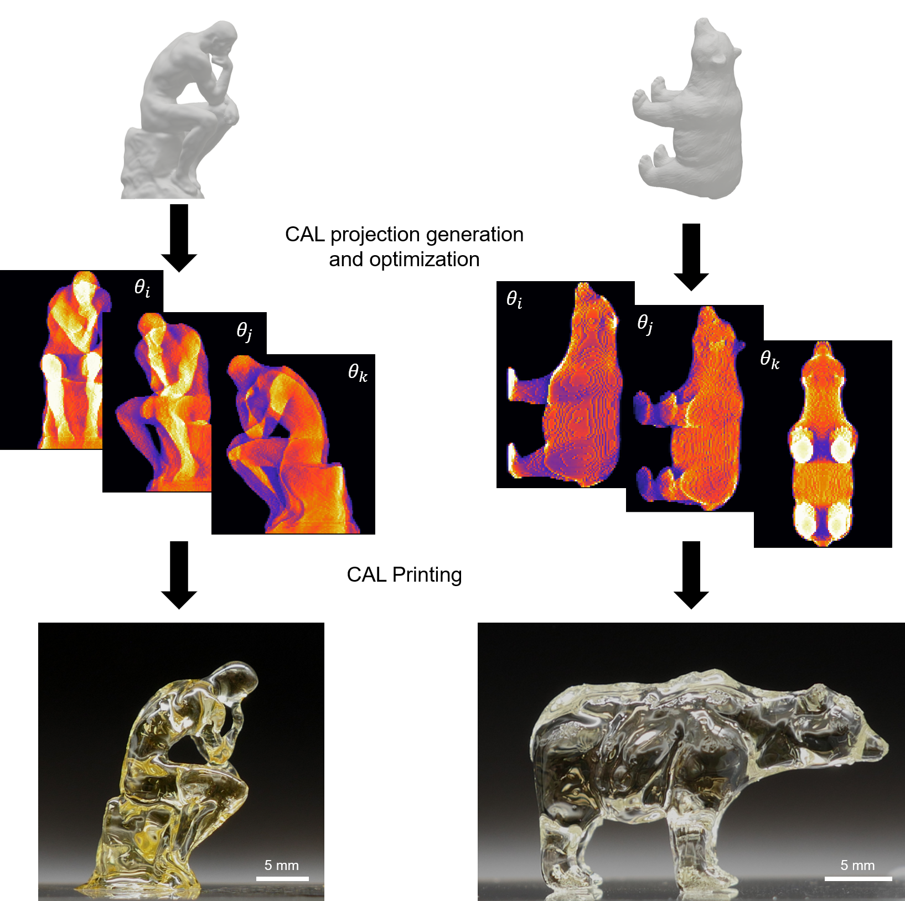

============
Introduction
============
.. highlight:: matlab

You have reached the documentation of the `CAL-software-Matlab`_ toolbox! Computed axial lithography (CAL) is a 3D printing process inspired by the tomographic principles of computed tomography (CT) scanning. It consists creating light intensity images with iterative optimization and projecting these with a DLP-type projector into a rotating vial of photocurable resin to acheive a prescribed dose in the shape of a target object. 

For installation instructions proceed to :ref:`setup`.

.. _`CAL-software-Matlab`: https://github.com/computed-axial-lithography/CAL-software-Matlab

Background
----------

Detailed descriptions of the algorithms that support CAL and the 3D printing process itself can be found in the following papers:

* `[Kelly2019]`_
* `[Kelly2017arxiv]`_

.. _`[Kelly2019]`: https://science.sciencemag.org/content/363/6431/1075
.. _`[Kelly2017arxiv]`: https://arxiv.org/pdf/1705.05893.pdf

CAL is an volumetric additive manufacturing process that uses spatial light modulation and principles of tomographic reconstruction to 
build 3D objects. CAL or physical tomographic reconstruction works by illuminating a cylindrical container of resin with modulated 
patterns of light that are refreshed in sync with the rotation of the container. The superposition of the light dose from each azimuthal 
projection creates a 3D dose distribution that photopolymerizes the resin into the desired object.

This code package is provided to support the generation of the light projections and the control of a DLP projector through Matlab.

Citation
--------

If you use this code in your research, please cite the following publication `[Kelly2019]`_:
::
   [1] B.E. Kelly, I. Bhattacharya, H. Heidari, M. Shusteff, C.M. Spadaccini, H.K. Taylor, Volumetric additive manufacturing via tomographic reconstruction, Science (80-. ). 363 (2019) 1075–1079. https://doi.org/10.1126/science.aau7114.

Bibtex entry:
::
   @article{Kelly2019a,
   author = {Kelly, Brett E. and Bhattacharya, Indrasen and Heidari, Hossein and Shusteff, Maxim and Spadaccini, Christopher M. and Taylor, Hayden K.},
   doi = {10.1126/science.aau7114},
   issn = {10959203},
   journal = {Science},
   number = {6431},
   pages = {1075--1079},
   title = {{Volumetric additive manufacturing via tomographic reconstruction}},
   volume = {363},
   year = {2019}
   }
