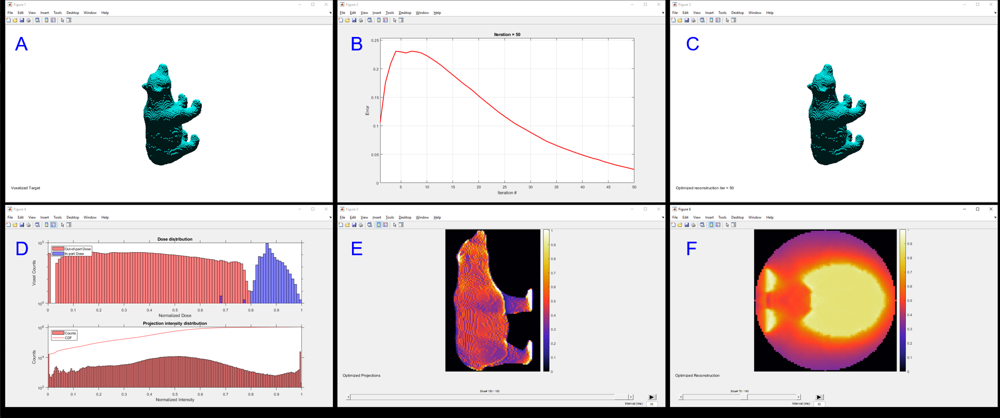
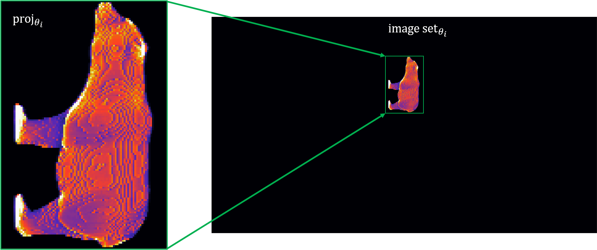

=====
Usage
=====
.. highlight:: matlab

Target preparation
##################

To begin the optimization process, first the target is prepared. The target may be a 2D matrix, a 3D matrix, or a .stl file. In general,
the :func:`CALPrepTarget` is used. Run the function with .stl filename (full path to the .stl file) and the z-slicing resolution. This will
create a :class:`TargetObj` which is saved as ``target_obj`` here:
::
    % prepare the target (.stl)
    verbose = 1;
    resolution = 100;
    stl_filename = 'C:\...\test.stl';
    target_obj = CALPrepTarget(stl_filename,resolution,verbose);

Alternatively, for directly inputting a 2D or 3D matrix, the function should be run as:
::
    % prepare the target (2D matrix)
    target_2D = double(phantom(256)>0.01);
    target_obj = CALPrepTarget([],[],verbose,target_2D);

    % prepare the target (3D matrix)
    target_3D = repmat(double(phantom(256)>0.01),[1,1,50]);
    target_obj = CALPrepTarget([],[],verbose,target_3D);

----

Projection generation and optimization
######################################

With the target prepared, the projection generation and optimization can begin. The class :class:`CALOptimize` is used to perform projection generation and optimization. First, define the projection parameters and the optimization parameters (these are just some examples for demonstration, more information about these parameters can be found in the :ref:`optimization` code reference:
::
    % define projection parameters
    proj_params.angles = linspace(0,179,180);
    proj_params.bit8 = 1;

    % define optimization parameters
    opt_params.max_iter = 50;
    opt_params.threshold = 0.8;
    opt_params.learning_rate = 0.005;

Then initialize the class :class:`CALOptimize` with these parameters and the :class:`TargetObj` created above:
::
    % instantiate the optimization class
    Opt = CALOptimize(target_obj,opt_params,proj_params,verbose);

Then run the optimization with the class function :func:`run`:
::
    % run the optimization
    [proj_obj,recon_obj,Opt] = Opt.run();

This creates (1) a :class:`ProjObj` containing the optimized projections, (2) :class:`ReconObj` containing the optimized reconstruction, and (3) 
an updated instance of the :class:`CALOptimize` with the error and thresholds calculated during optimization.

If ``verbose = 1``, during and after optimization, a few plots will appear along with the optimization run time in the command line. The plots
that appear.

* **A**: Target 
* **B**: Error vs iterations convergence plot. See :ref:`optimization` in the code reference for details on how error is defined.
* **C**: Current reconstruction which updates during optimization. For 3D targets (like shown in the figure) the thresholded reconstruction is plotted. For 2D targets, the reconstruction will appear as a 2D non-thresholded image.
* **D**: Histograms of the optimized dose distribution and the projection intensity distribution. The dose distribution is divided into in-part dose which corresponds to the dose delivered the pixels/voxels inside the target and out-of-part dose which corresponds to the dose delivered to the pixels/voxels outside of the target.
* **E**: Optimized projections (from the view of the projector, for 2D targets, a sinogram will appear). The projection can be selected by the horizontal scroll bar or by hovering over the image and using the scroll wheel.
* **F**: Optimized reconstruction (z-slice view). The z-slice can be changed like the projection. 

Threshold
---------

Optimization can be performed with a threshold specified or the threshold can float to the value that gives the minimum error. To specify the threshold, the ``threshold`` optimization parameter is set to a value between 0 and 1 (normalized dose is assumed). 

One reason to specify the threshold (vs. floating), is to constrain the in-target dose to have smaller variation thus higher uniformity (i.e., if the threshold is set to be closer to 1, the dose will be squeezed to a smaller range). This is useful in printing because it means that the target is more likely to photopolymerize more simultaneously. However, setting a higher threshold constrains the optimization more, so the converged minimum error may be higher. Also, setting a threshold may cause poor convergence early in the optimization as the initial guess (Ram-Lak filtered and positivity-constrained projections) may produce a reconstruction with threshold far from what is specified. It may require a few iterations to reach a point where error will begin to decrease. This effect, while minor here, can be observed in **B** of the figure because the threshold was set to 0.8.

Observing the histogram in **D** in the figure, the threshold is the dose value at which the in-part and out-of-part dose histograms should be divided. For simple targets, the overlap between histograms near the threshold will be small if any, whereas for complex targets, some overlap i.e., non-zero error, will be nearly inevitable.

Using 8-bit data in optimization
--------------------------------

Most projectors or spatial light modulators accept a standard 8-bit image as input. This means there are 256 possible intensity values 0 to 255. When performing an optimization, the optimization parameter ``bit8 = 1`` can be used to enforce that projections should be 8-bit instead of double precision in order to capture the finite contrast of a projector in optimization. When this parameter is activated, the minimum error at convergence may be higher than when deactivated. Additionally, when this parameter is activated, the optimization will perform a contrast equalization/stretching on each iteration in order to maximize the use of the total available contrast in an 8-bit projection. 

If ``bit8 = 0``, this parameter is deactivated and the optimization will instead default to using double precision. The projections from this optimization will likely produce less error but will result in longer print times because infinite available contrast is assumed (i.e., there will be a few pixels/voxels of high intensity while the rest are low. This can be observed in the projection intensity histogram when comparing optimal projections for given target with and without ``bit8`` activated.)

More information on setting optimization parameters (:ref:`optimization` and :ref:`examples`).

----

Creating image sets
###################

Image sets are what is typically used to when commanding the projector system during a CAL print. They are generated from the optimized projections given some image parameters that perform scaling, rotation, multiplication, etc. based on the configuration of the CAL system and the desired print characteristics. More information on the image parameters can be found in :ref:`imagesetcreation` in the code reference.

To generate an image set, you can use the :class:`CALCreateImageSet` class. First, initialize the class with the :class:`ProjObj`, generated during optimization, and the image parameters:
::
    image_params.size_scale_factor = 2; % size scale of the projection within the image
    image_params.z_offset = 200;        % offset in vertical direction in # of pixels
    C = CALCreateImageSet(proj_obj,image_params);

Then use the class function :func:`run` to start creating the image set:
::
    image_set_obj = C.run();

Here :func:`run` creates an :class:`ImageSetObj` and it is saved to ``image_set_obj`` in this example case. 

Saving images from an image set
-------------------------------

If you would like to save the image set as individual images, the class function :func:`saveImages` can be used. You can use the instance of the :class:`CALCreateImageSet` class created above as:
::
    % saveImages(ImageSetObj,save filepath,image filetype)
    C.saveImages(image_set_obj,pwd,'.png');

Or you can run the class function :func:`saveImages` standalone if you only have the :class:`ImageSetObj` as:
::
    CALCreateImageSet.saveImages(image_set_obj,pwd,'.png');

A folder called ``images`` will be created at the specified filepath (here the current working directory is used) and the images will be saved individually into the folder with filenames ``0001.png``, ``0002.png``, and so on.

Backward compatibility
----------------------

Previous versions of the CAL-software-Matlab toolbox have used a "plain" 3D projection matrix when generating the image set. In the current and all future versions of the toolbox, the projection matrix is contained in the :class:`ProjObj` along with all of the parameters that were used to create the optimized projection matrix. 

:class:`CALCreateImageSet` takes in a :class:`ProjObj` and uses these parameters to generate the correct image set. However, it has also been designed to accept a "plain" 3D projection matrix in place of the :class:`ProjObj` as long as the image parameter ``angles`` is set to the angles at which this "plain" projection matrix was calculated. 

----

Image projection control
########################

Once the image set is created, image projection with the DLP projector can begin. To do this, the toolbox assumes that `Pysch Toolbox 3 for Matlab`_ is installed. Pysch Toolbox allows precise control of images on a DLP projector that is connected as a second monitor. 

To begin, the projector should be connected as a second monitor and should be responsive to changes such as a system file explorer being dragged across the monitor or normal web video. The following code can be used to check if Matlab recognizes there are two monitors:
::
    monitors = get(groot,'MonitorPositions')

Once you verify the monitor number corresponding to the projector, you can begin the image projection by first initializing the :class:`CALProjectImageSet` with the :class:`ImageSetObj` created in the previous section and the rotation velocity of the rotation stage in degrees/s as:
::
    DLP = CALProjectImageSet(image_set_obj,24);

The DLP projector is assumed to be the second monitor by default. If your projector is not the second monitor, you may also specify the monitor number (4 as an example) as a third argument:
::
    DLP = CALProjectImageSet(image_set_obj,24,4);

When initializing, sometimes the projector can flash a bright image so make sure that the resin remains blocked from light at this point. 

Next, to begin projecting, use the class function :func:`startProjecting`:
::
    DLP.startProjecting();

After this, by default, the code will wait until the user presses the **space bar** to begin playing the image sequence. This is a good time to remove a light blocker in front of the resin. Then, as the image sequence plays the user can press the **tab key** to pause the image sequence (**space bar** resumes the sequence). To stop the image sequence at any time, the user can press the **escape key**.

For more information setting up the image sequence projection, see :ref:`imageproject` and :ref:`examples`.

.. _`Pysch Toolbox 3 for Matlab`: http://psychtoolbox.org/download

-----

Saving data for later use
#########################

If you would like to use any data at later time, any of :class:`TargetObj`, :class:`ProjObj`, :class:`ReconObj`, and :class:`ImageSetObj` objects can be saved. Often it will be useful to save the projections and image sets (:class:`ProjObj` and :class:`ImageSetObj`) for later use.

Use Matlab's ``save()`` as you would for any other matrix. For the examples, one would use the following code to save these objects:
::
    % 'Example.mat' is the filename
    % 'target_obj','proj_obj','recon_obj','image_set_obj' are the variables being saved
    save('Example.mat','target_obj','proj_obj','recon_obj','image_set_obj')

