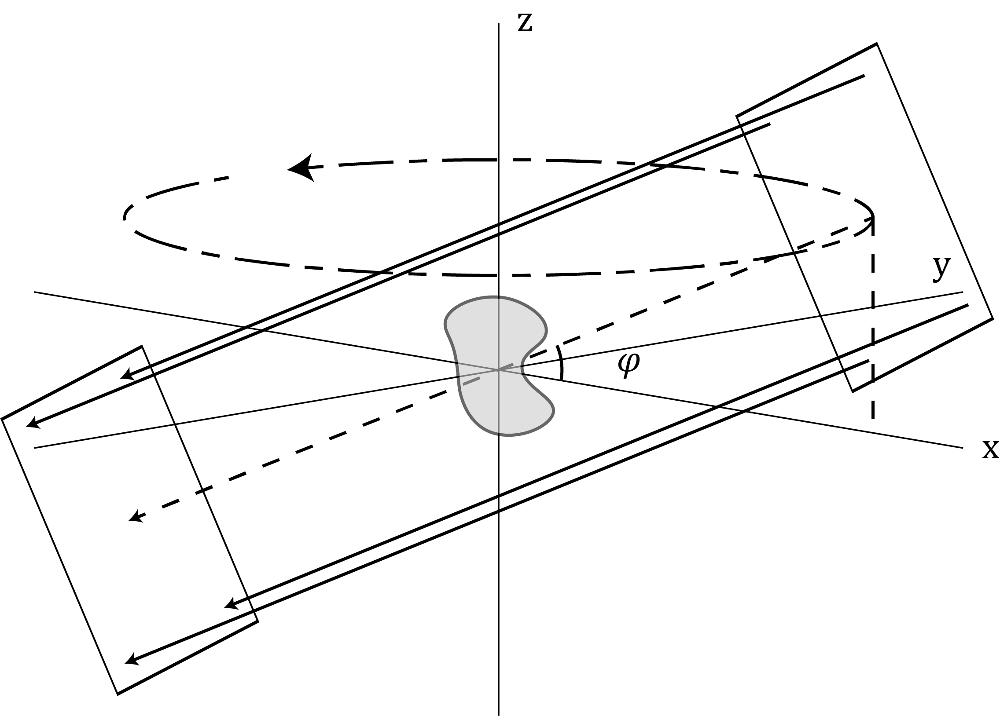
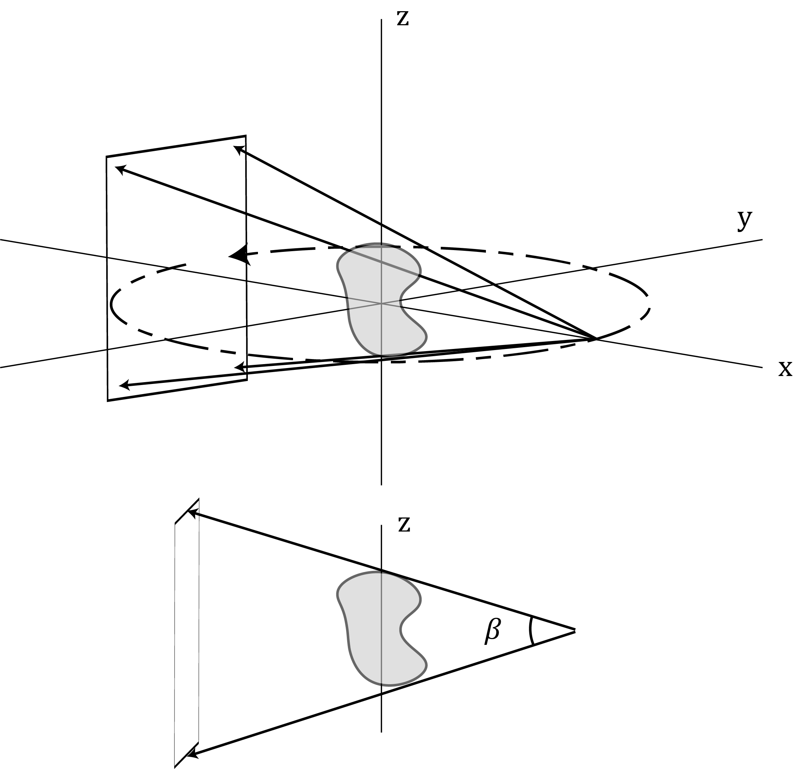

.. highlight:: matlab

Projection generation and optimization
######################################

Projection
----------

With the target prepared, the projection generation and optimization can begin. The class :class:`CALOptimize` is used to perform projection generation and optimization. First, define the projection parameters and the optimization parameters (these are just some examples for demonstration, more information about these parameters can be found in the :ref:`optimization` code reference:
::
    % define projection parameters
    proj_params.angles = linspace(0,179,180);
    proj_params.bit8 = 1;

    % define optimization parameters
    opt_params.max_iter = 50;
    opt_params.threshold = 0.8;
    opt_params.learning_rate = 0.005;

The default projection geometry is parallel beam perpendicular to the axis of rotation. However, there are other possible projections geometries including cone beam and laminographic (parallel or cone beam) geometries. These are selected by specifying non-zero ``proj_params``: ``cone_angle`` and/or ``incline_angle`` in degrees. **Additionally,** ``proj_params.CUDA`` **must be set to true to enable these geometries (which implies that your PC has a NVIDIA CUDA GPU).** These geometries are depicted in the figure below.

Parallel beam laminography where :math:`\varphi` is the incline angle which is set with the parameter ``proj_params.incline_angle`` = :math:`\varphi`.

Cone beam where :math:`\beta` is the maximum cone angle along the z-axis which is set with the parameter ``proj_params.cone_angle`` = :math:`\beta`.

Optimization
------------
Then initialize the class :class:`CALOptimize` with these parameters and the :class:`TargetObj` created above:
::
    % instantiate the optimization class
    Opt = CALOptimize(target_obj,opt_params,proj_params,verbose);

Then run the optimization with the class function :func:`run`:
::
    % run the optimization
    [proj_obj,recon_obj,Opt] = Opt.run();

This creates (1) a :class:`ProjObj` containing the optimized projections, (2) :class:`ReconObj` containing the optimized reconstruction, and (3) 
an updated instance of the :class:`CALOptimize` with the error and thresholds calculated during optimization.

If ``verbose = 1``, during and after optimization, a few plots will appear along with the optimization run time in the command line. The plots
that appear.

.. image:: images/figure_layout.png
   :width: 1000

* **A**: Target 
* **B**: Error vs iterations convergence plot. See :ref:`optimization` in the code reference for details on how error is defined.
* **C**: Current reconstruction which updates during optimization. For 3D targets (like shown in the figure) the thresholded reconstruction is plotted. For 2D targets, the reconstruction will appear as a 2D non-thresholded image.
* **D**: Histograms of the optimized dose distribution and the projection intensity distribution. The dose distribution is divided into in-part dose which corresponds to the dose delivered the pixels/voxels inside the target and out-of-part dose which corresponds to the dose delivered to the pixels/voxels outside of the target.
* **E**: Optimized projections (from the view of the projector, for 2D targets, a sinogram will appear). The projection can be selected by the horizontal scroll bar or by hovering over the image and using the scroll wheel.
* **F**: Optimized reconstruction (z-slice view). The z-slice can be changed like the projection. 

Threshold
---------

Optimization can be performed with a threshold specified or the threshold can float to the value that gives the minimum error. To specify the threshold, the ``threshold`` optimization parameter is set to a value between 0 and 1 (normalized dose is assumed). 

One reason to specify the threshold (vs. floating), is to constrain the in-target dose to have smaller variation thus higher uniformity (i.e., if the threshold is set to be closer to 1, the dose will be squeezed to a smaller range). This is useful in printing because it means that the target is more likely to photopolymerize more simultaneously. However, setting a higher threshold constrains the optimization more, so the converged minimum error may be higher. Also, setting a threshold may cause poor convergence early in the optimization as the initial guess (Ram-Lak filtered and positivity-constrained projections) may produce a reconstruction with threshold far from what is specified. It may require a few iterations to reach a point where error will begin to decrease. This effect, while minor here, can be observed in **B** of the figure because the threshold was set to 0.8.

Observing the histogram in **D** in the figure, the threshold is the dose value at which the in-part and out-of-part dose histograms should be divided. For simple targets, the overlap between histograms near the threshold will be small if any, whereas for complex targets, some overlap i.e., non-zero error, will be nearly inevitable.

Using 8-bit data in optimization
--------------------------------

Most projectors or spatial light modulators accept a standard 8-bit image as input. This means there are 256 possible intensity values 0 to 255. When performing an optimization, the optimization parameter ``bit8 = 1`` can be used to enforce that projections should be 8-bit instead of double precision in order to capture the finite contrast of a projector in optimization. When this parameter is activated, the minimum error at convergence may be higher than when deactivated. Additionally, when this parameter is activated, the optimization will perform a contrast equalization/stretching on each iteration in order to maximize the use of the total available contrast in an 8-bit projection. 

If ``bit8 = 0``, this parameter is deactivated and the optimization will instead default to using double precision. The projections from this optimization will likely produce less error but will result in longer print times because infinite available contrast is assumed (i.e., there will be a few pixels/voxels of high intensity while the rest are low. This can be observed in the projection intensity histogram when comparing optimal projections for given target with and without ``bit8`` activated.)

More information on setting optimization parameters (:ref:`optimization` and :ref:`examples`).

----
