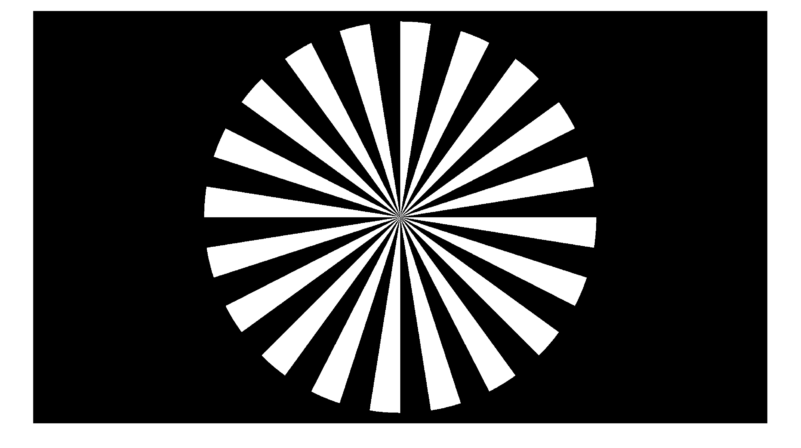
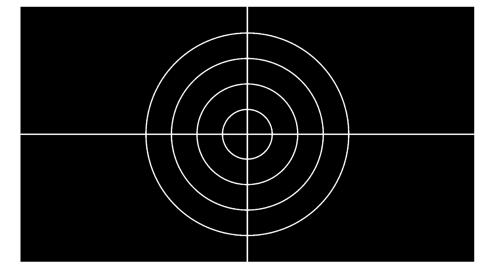
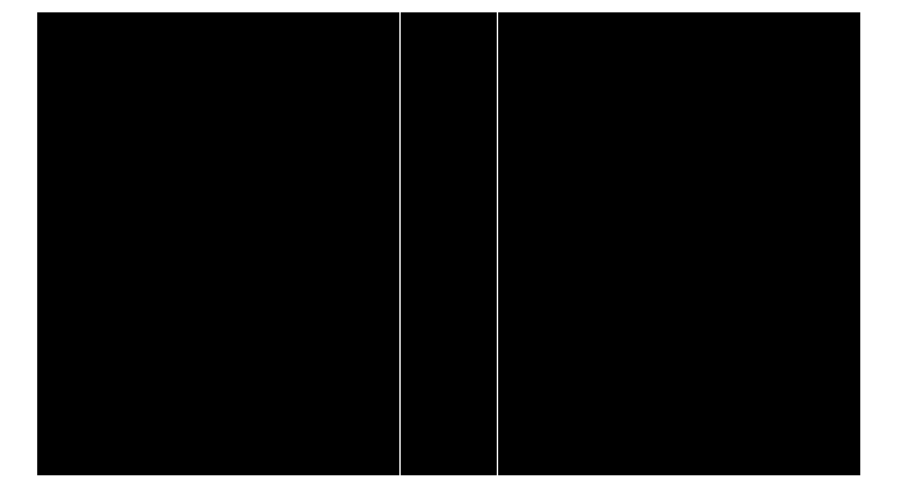
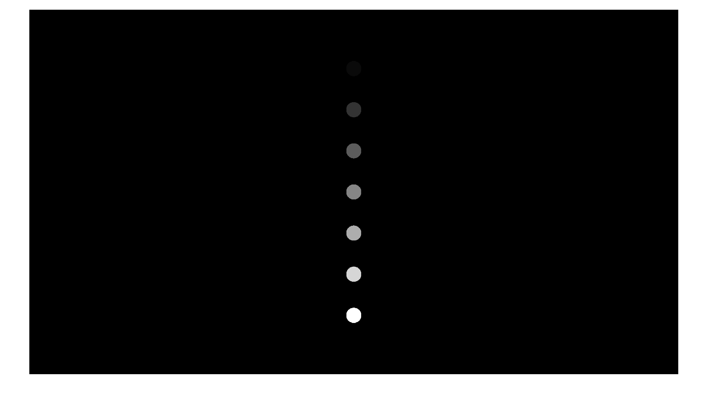

.. highlight:: matlab

System setup
############

The library includes several functions for system setup and calibration in the :class:`CALSetup`. Here they are described and examples are shown for each. Each function outputs the image that is displayed for convenience, however, the function can be run without an output assignment. Additionally, :func:`CALSetup.axisAlignment()` and :func:`CALSetup.resinCalibration()` output parameters after adjustment so that the user can save them for later use if desired.

CALSetup.intensityCalibration()
-------------------------------
This function is used to calibrate intensity of the projector. The intention is that the user inputs a gray value (0-255) and measures the intensty at the focal plane. This could be used to measure the contrast ratio (white(255):black(0) ratio), for instance.

Example:
::
    % screen/projector pixel dimensions
    dimensions = [1920,1080];
    gray_value = 128;
    [image] = CALSetup.intensityCalibration(dimensions,gray_value);

Result:

CALSetup.focus()
----------------
This function is used to help the user set the focal plane of the system. It displays a Siemen's star pattern in the center of the image. 

Example:
::
    % screen/projector pixel dimensions
    dimensions = [1920,1080];
    [image] = CALSetup.focus(dimensions);

Result:

CALSetup.opticalAlignment()
---------------------------
This function is used to help the user align any auxiliary optics (in addition to projector lens) in the system. It displays a cross hair pattern.

Example:
::
    % screen/projector pixel dimensions
    dimensions = [1920,1080];
    [image] = CALSetup.opticalAlignment(dimensions);

Result:

CALSetup.axisAlignment()
------------------------
This function is used to help the user align the rotation axis to the central axis of the projected image. It displays two parallel vertical lines with space in between. The intention is that the user will place a vial or very straight cylindrical object in the rotation stage and adjust either the lateral position of the rotation stage or translate the two lines to find the lateral offset that should be applied to center images. This would be used as the transverse offset when creating an imageset, see :ref:`imagesetcreation` property ``t_offset``.

Example:
::
    % screen/projector pixel dimensions
    dimensions = [1920,1080];
    [image,spacing,thickness,t_offset] = CALSetup.axisAlignment(dimensions);
    
    % can be used with optional input arguments from previous testing
    [image] = CALSetup.axisAlignment(dimensions,spacing,thickness,t_offset);

While projecting, the user can use the keyboard to adjust the spacing, thickness, and transverse offset of the two lines. The table below gives a summary of the key functions:

+--------------------------+------------------------------+
| **Key**                  | **Action**                   |
+--------------------------+------------------------------+
| left / right arrow       | left/right shift by 1 pixel  |
+--------------------------+------------------------------+
| -_ / +=                  | dec/inc thickness by 1 pixel |
+--------------------------+------------------------------+
| [{ / ]}                  | dec/inc spacing by 1 pixel   |
+--------------------------+------------------------------+

Result:

CALSetup.resinCalibration()
---------------------------
This function is used to characterize resin response to light intensity. See Fig. S2. in Supplementary Materials of `[Kelly2019]`_ for more details. The spacing, radius, and height offset can be adjusted to match the size of the resin vial used in the experiment.

.. _`[Kelly2019]`: https://science.sciencemag.org/content/363/6431/1075

Example:
::
    % screen/projector pixel dimensions
    dimensions = [1920,1080];
    [image,spacing,circle_radius,z_offset] = CALSetup.resinCalibration(dimensions);

    % can be used with optional input arguments from previous testing
    % t_offset is an extra optional argument in case the setup has fixed rotation axis 
    [image] = CALSetup.resinCalibration(dimensions,spacing,circle_radius,z_offset,t_offset);

While projecting, the user can use the keyboard to adjust the spacing, radius, and vertical offset of the disks. The table below gives a summary of the key functions:

+--------------------------+------------------------------+
| **Key**                  | **Action**                   |
+--------------------------+------------------------------+
| up / down arrow          | up/down shift by 1 pixel     |
+--------------------------+------------------------------+
| -_ / +=                  | dec/inc radius by 1 pixel    |
+--------------------------+------------------------------+
| [{ / ]}                  | dec/inc spacing by 1 pixel   |
+--------------------------+------------------------------+

Result:

    